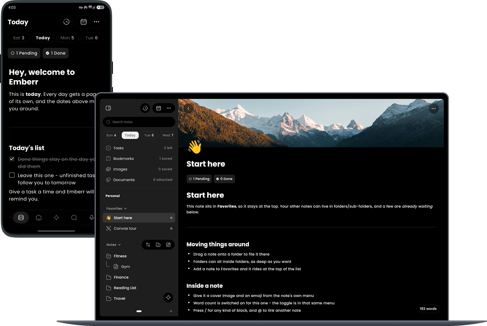

# Emberr: Private Productivity

Emberr is a 100% open-source, offline-first, privacy-focused notes and productivity app. It combines a **block-based editor, tasks, reminders, and a calendar** in one place, with your data stored on your device by default.

> **Beta:** Emberr is still in beta. Expect some rough edges and occasional bugs.



<a href="https://apps.obtainium.imranr.dev/redirect?r=obtainium://add/https://github.com/benny10ben/Emberr-Private_Productivity"></a>

### Why I Built This

Why spend months building this when apps like Notion and Obsidian already exist? Honestly, I just got annoyed.

Most of the popular apps are closed-source, so who knows what they're doing with your data. The open-source ones are cool, but Linux and Android always feel like an afterthought. On top of that, a lot of them are just clunky, slow, and look old.

I started Emberr as a side project to learn more about backend systems and mess around with full-stack stuff. But mainly, I just wanted an app for myself - something private, clean, and fast on the devices I actually use every day.

Figured I might as well share it. If you're also tired of ugly UIs, privacy headaches, or getting ignored as an Android or Linux user, please give Emberr a shot.

## Features

- Block-based editor for notes, checklists, tables, and more
- Spaces to keep different parts of your life (work, personal, school) separate
- Attach images, documents, and voice notes to any note
- Daily notes with automatic task rollover
- Built-in calendar and reminders
- Mobile to desktop sync (your data is encrypted and signed, even on public Wi-Fi)
- Self-host your data on your own server (the data is encrypted on the server)
- AI is off by default. If you want it, you can run a local model on your device or use your own API key
- No trackers, no ads, no sharing data to third parties

## Roadmap

### Short term

- UI / UX and performance improvements
- Keyboard shortcuts for the desktop app
- Split views
- Support for ARM based desktops
- Improved Kanban and gallery views for the database block
- Login/credentials block to store important info (hopefully with autofill too)
- Improved local AI
- Code cleanup

### Long term

- Online account with cloud backup (end to end encrypted, of course)
- Make each note shareable on the web
- Share the same note, folder, or space with other users
- Support for community plugins (if this project gets many users) (2027/28)
- Release for iOS and macOS (if I'm not broke TT) (2027/28)

## Platforms

Android, Linux and Windows for now.
## Tech Stack

- **UI:** Compose Multiplatform (Android & Desktop)
- **Language:** Kotlin, with Coroutines and Flow for async work
- **Local storage:** Room (KMP) for app data, SQLDelight for the AI search index, SQLCipher for database encryption
- **Dependency injection:** Koin
- **Networking:** Ktor
- **On-device AI:** llama.cpp based local inference (via llamatik)

## Installation

Every release is on the [Releases](https://github.com/benny10ben/Emberr-Private_Productivity/releases) page.

### Android

**Option 1: Download the APK**

Download [Emberr-android.apk](https://github.com/benny10ben/Emberr-Private_Productivity/releases) and open it on your phone to install it. Android may ask you to allow installing apps from your browser.

**Option 2: Obtainium**

Emberr can be tracked and auto-updated with [Obtainium](https://github.com/ImranR98/Obtainium):

1. Open Obtainium and tap **Add App**.
2. Paste this repository's URL: `https://github.com/benny10ben/Emberr-Private_Productivity`
3. Tap **Add** and Obtainium will pull the latest release and keep it updated.

### Linux

**Option 1: Tarball (recommended, adds Emberr to your app menu)**

Download [emberr-x86_64.tar.gz](https://github.com/benny10ben/Emberr-Private_Productivity/releases), then run:

```sh
cd ~/Downloads
tar -xzf emberr-x86_64.tar.gz
./emberr-*-x86_64/install.sh
```

It installs for your user only, with no root needed. To remove it, run `uninstall.sh` from the same extracted folder.

**Option 2: AppImage (one file, nothing to install)**

Download [Emberr-x86_64.AppImage](https://github.com/benny10ben/Emberr-Private_Productivity/releases), then run:

```sh
cd ~/Downloads
chmod +x Emberr-x86_64.AppImage
./Emberr-x86_64.AppImage
```

### Windows

Download [Emberr-Setup-x86_64.exe](https://github.com/benny10ben/Emberr-Private_Productivity/releases) and run it.

The installer isn't code-signed yet, so Windows may show "Windows protected your PC". Click **More info**, then **Run anyway**.

### Updates

In-app updates are available for Linux and Windows. On Android, Emberr checks for new versions and opens the release page, or you can let Obtainium handle updates.

### Build from source

1. Clone the repository: `git clone https://github.com/benny10ben/Emberr-Private_Productivity.git`
2. Open the project in Android Studio and let Gradle sync.
3. Run `./gradlew :app:assembleDebug` to build the APK, or `./gradlew :shared:run` to start the desktop app.

## Contributing

See [CONTRIBUTING.md](CONTRIBUTING.md) if you would like to help out.

## License

Emberr is licensed under the GNU Affero General Public License v3.0. See [LICENSE](LICENSE) for details.


Made by - [Benny](https://github.com/benny10ben)
